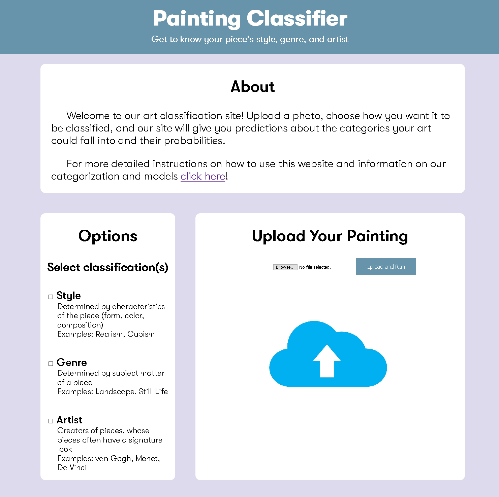

# FA20-CS121 Painting Classifier
Harvey Mudd College FA20 CS121 Section 2: Deep Learning Classification of Art Pieces

## About
[Image Classifier](https://arctic-anvil-294604.wn.r.appspot.com/) is a web app created for the purpose of classifying images. Our target audience is art students who are learing how to identify art on their own, or aspisring artists who are curius about what their painting would be classified as. The web app uses trained convolutional neural network models to classify the Style, Artist, and Genre of an art piece. 

Once the models have classified the painting, the app displays the results and the confidence level for each result. In addition, it uses a [Google Custom Search](https://developers.google.com/custom-search/v1/overview) API to find other similar paintings in the same categories.

## Usage
[Click here](https://arctic-anvil-294604.wn.r.appspot.com/instructions) for detailed instructions on how to use the site.

## Hosting
Painting Classifier is currently hosted on the [Google Cloud Platform](https://console.cloud.google.com/appengine/start).

## Models

All of our models are hosted at the
[FA20-CS121-fastai](https://www.github.com/kiphenglim/FA20-CS121-fastai)
repository. You can see our data preparation and training scripts.

## Acknowledgements

We owe a huge thanks to our colleagues, professors, and grutors for
being an immense resource during the development process. We also
thank the authors of the ICIP2016 paper "Ceci n’est pas une pipe: A
Deep ConvolutionalNetwork for Fine-art Paintings Classification" for
providing the inspiration for this project. In particular, our
gratitude goes to @cs-chan for providing the formatted source data for
our training. Finally, we thank the WikiArt team for compiling a rich
database of visual artworks that can be enjoyed by the public and used
by researchers alike.

## Contributors
[Sam Freisem-Kirov](https://github.com/Sfreisem-Kirov) 

[Skylar Gering](https://github.com/skygering)

[Thuy-Linh Le](https://github.com/TLinhTCDLAL)

[Ki Pheng Lim](https://github.com/kiphenglim)

[Vivian Pou](https://github.com/vivpou)

